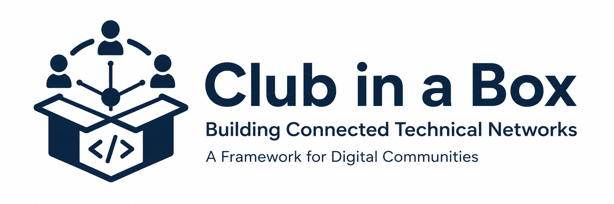

<p align="center">
  
</p>

# Club In A Box

Reusable materials for starting, running, connecting, and sustaining community-led coding and digital research clubs.

This repository is for anyone who wants to create a welcoming technical community: research software engineers, digital research technical professionals, data scientists, librarians, research groups, doctoral communities, professional services teams, and cross-institution networks.

Use it however you want. Copy it, fork it, adapt it, translate it, strip it down, build on it, or use just one template for one meeting. If you improve something, please open a pull request so others can benefit too. If something is missing, unclear, inaccessible, too institution-specific, or just not useful yet, please open an issue.

## Website

This repository includes a navigable static website at [index.html](index.html). It lets people browse, filter, view, and download resources without needing to dig through the file tree.

To preview it locally:

```bash
python3 -m http.server 8000
```

Then open <http://localhost:8000>.

## What This Helps You Do

- Start a new coding, data, software, AI, reproducibility, or digital research club.
- Run practical sessions without designing every meeting from scratch.
- Make sessions inclusive, accessible, and welcoming to beginners.
- Rotate facilitation so one person does not become a single point of failure.
- Connect several clubs through a shared calendar, shared language, and common templates.
- Evaluate what is working and package learning for reuse elsewhere.

## Start Here

1. Read the [quickstart guide](docs/quickstart.md).
2. Fill in the [club canvas](templates/club-canvas.md).
3. Adapt the [club charter](templates/club-charter.md).
4. Plan your first session with the [session plan](templates/session-plan.md).
5. Share the event using the [announcement template](templates/event-announcement.md).
6. Gather feedback with the [feedback form](templates/feedback-form.md).

## Paths Through The Box

| If you are... | Start with |
| --- | --- |
| Launching a brand-new club | [Launch a club](playbooks/launch-a-club.md) |
| Running your first meeting | [Run a session](playbooks/run-a-session.md) |
| Trying to avoid founder burnout | [Grow distributed leadership](playbooks/grow-distributed-leadership.md) |
| Connecting several existing clubs | [Connect clubs](playbooks/connect-clubs.md) |
| Mapping existing digital research communities | [Map the community landscape](playbooks/map-community-landscape.md) |
| Running a regular anchor day | [Anchor day model](docs/anchor-day.md) |
| Packaging learning with members | [Run a co-design workshop](playbooks/run-a-codesign-workshop.md) |
| Reporting impact or learning | [Evaluate impact](playbooks/evaluate-impact.md) |
| Building a website for your club | [Website guidance](docs/website.md) |

## Website Option

If your club needs a simple public website, you can use the Research Coding Community template:

- Website template: [Research-Coding-Community/Coding_Club_Template](https://github.com/Research-Coding-Community/Coding_Club_Template)
- Example club using it: [Research-Coding-Community/biocode_club](https://github.com/Research-Coding-Community/biocode_club)

The website template is a good companion to this repository: use Club In A Box for the operating model and session resources, then use the website template to publish your club schedule, resources, and contact routes.

## What Is Included

- [Docs](docs/) for principles, inclusion, facilitation, anchor days, calendars, sustainability, websites, and evaluation.
- [Templates](templates/) for charters, events, session plans, surveys, co-design workshops, risk registers, retrospectives, and leadership reflection.
- [Playbooks](playbooks/) for common club workflows.
- [Examples](examples/) that can be copied into a new club.
- [Download packs](downloads/) for visitors who want resource bundles.
- [GitHub issue templates](.github/ISSUE_TEMPLATE/) so people can suggest improvements, share club stories, or request new materials.
- [Attribution notes](ATTRIBUTION.md) with the reuse credit text.

## Design Principles

- Open by default: reusable materials should be easy to copy, adapt, and attribute.
- Community-led: the club should not depend on one permanent organiser.
- Practical over polished: useful, regular, welcoming activity matters more than perfect branding.
- Inclusive by design: plan for newcomers, different disciplines, different job families, different confidence levels, and different access needs.
- Lightweight governance: make roles, decisions, and expectations visible without creating unnecessary administration.
- Local enough to work, general enough to travel: clubs should fit their setting while still producing patterns others can reuse.

## Contributing

Contributions are welcome from any club, institution, discipline, or career stage. Good contributions include:

- New session formats.
- Improved facilitation notes.
- Accessibility improvements.
- Better onboarding materials.
- Examples from clubs that have adapted the box.
- Issue templates, checklists, or evaluation questions.
- Translations or localised variants.

Read [CONTRIBUTING.md](CONTRIBUTING.md) for the contribution process. Small improvements are useful; you do not need to redesign the whole repository to open a pull request.

## Funding Acknowledgement

This repository was created as part of the project "Building Connected Technical Networks: A Framework for Digital Communities".

This project has received funding through the UKRI Digital Research Infrastructure Programme via the DisCouRSE Network.

## License

This repository is available under [CC BY 4.0](LICENSE.md), unless a file says otherwise.

See [ATTRIBUTION.md](ATTRIBUTION.md) for provenance notes, external links, and logo asset notes.
